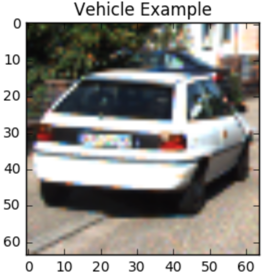
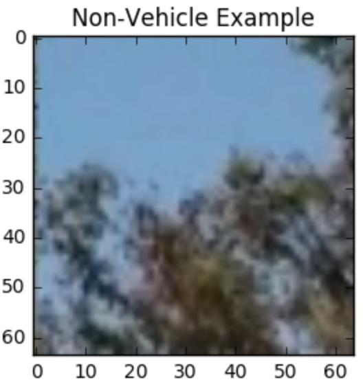
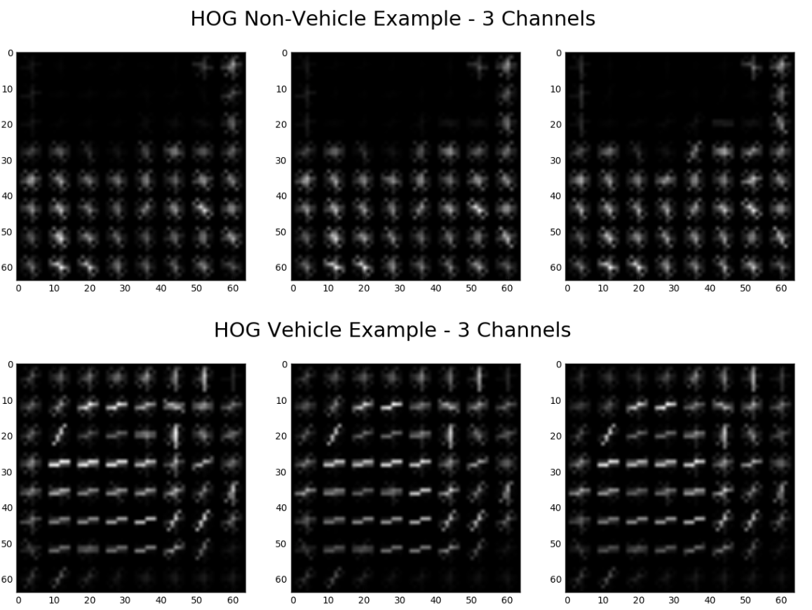
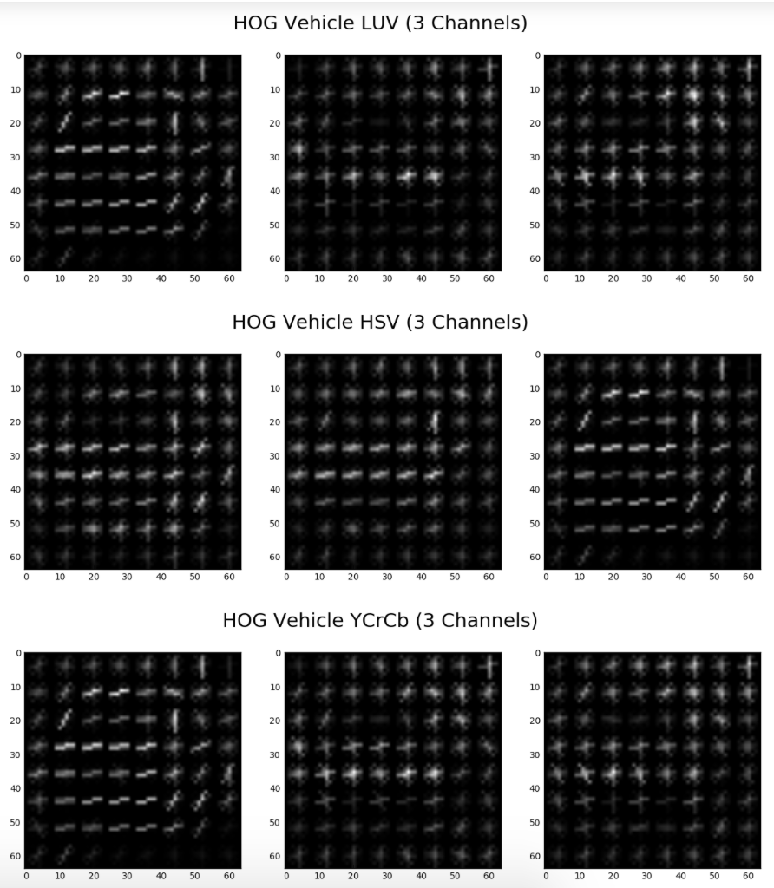
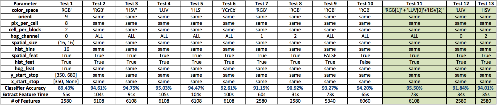
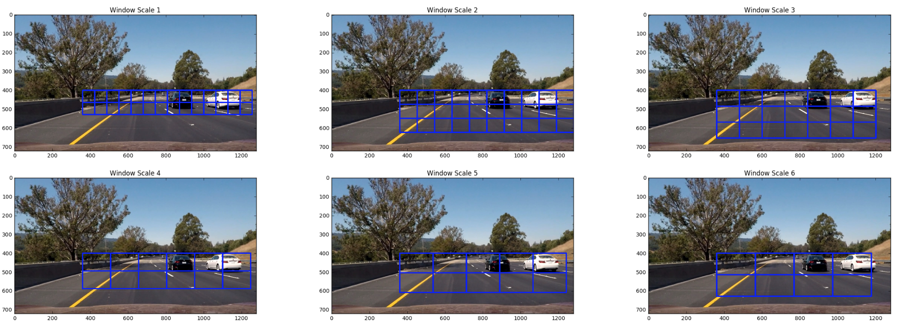
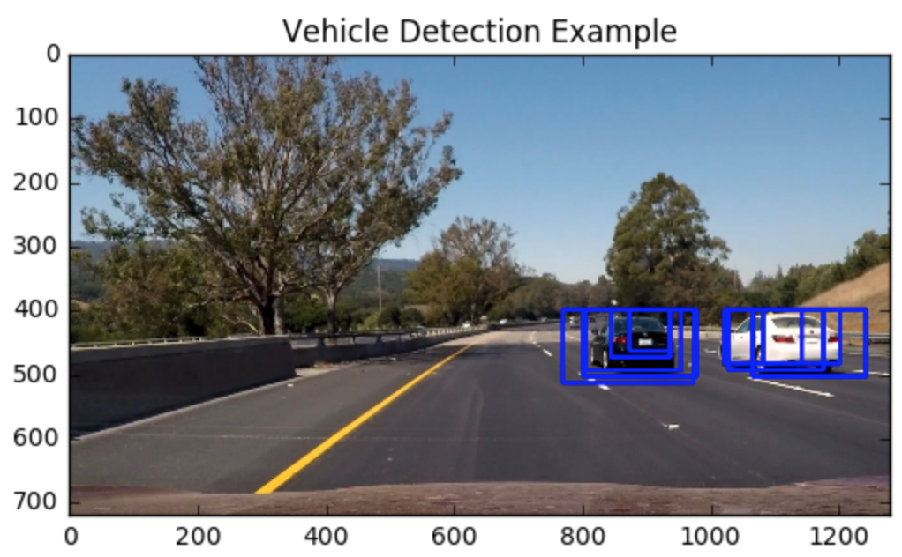
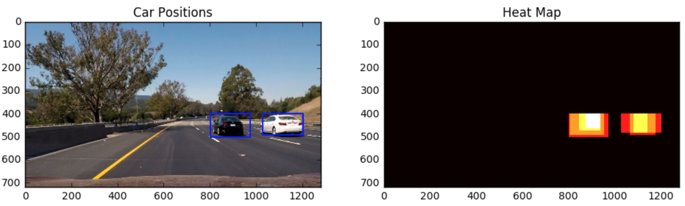

## Udacity SDC Nanodegree Project  5 - Vehicle Detection
---

The goals / steps of this project are the following:

* Perform a Histogram of Oriented Gradients (HOG) feature extraction on a labeled training set of images and train a classifier Linear SVM classifier
* Optionally, you can also apply a color transform and append binned color features, as well as histograms of color, to your HOG feature vector. 
* Note: for those first two steps don't forget to normalize your features and randomize a selection for training and testing.
* Implement a sliding-window technique and use your trained classifier to search for vehicles in images.
* Run your pipeline on a video stream (start with the test_video.mp4 and later implement on full project_video.mp4) and create a heat map of recurring detections frame by frame to reject outliers and follow detected vehicles.
* Estimate a bounding box for vehicles detected.

#### The following sections address each of the rubric points for the project and describe my approach for tackling each of them. All images in the writeup are saved in the folder called `output_images`.

---
### Writeup / README

#### 1. Provide a Writeup / README that includes all the rubric points and how you addressed each one. 

Provided below.

### Histogram of Oriented Gradients (HOG)

#### 1. Explain how (and identify where in your code) you extracted HOG features from the training images.

Section 2 titled “Define Pipeline Functions” in the IPython Notebook (P5-VehicleDetection-Rev1.ipynb) contains each of the functions used to process images and train my classifier. After reading in all the available training images (8792 vehicle images and 8968 non-vehicle images), I then perform various operations to extract features from the images. Examples of the vehicle and non-vehicle images that were used to train the classifier are shown below: 




The functions `get_hog_features()` and `find_cars()` are what I used to extract HOG features from the images. Using the `get_hog_features()` function, I have shown below images of HOG features for the “vehicles” and “non-vehicles” images using each of the 3 RGB channels. 



There are many parameters that can be adjusted for the `skimage.hog()` HOG features tool. After some experimentation, I stuck with the baseline parameters of `orientations=9`, `pixels_per_cell=(8, 8)` and `cells_per_block=(2, 2)` as I did not see much improvement in the accuracy of my linear SVM classifier when I varied these parameters. 

My main tuning for the HOG features was the color spaces and the number of channels used. The HOG features for each channel for LUV, HSV, and YCrCb colorspaces can be seen below. Different color channels of the various color spaces show more distinct HOG features. For example, the "L" channel of the LUV colorspace appears to give much more gradient information than the "U" channel.



#### 2. Explain how you settled on your final choice of HOG parameters.

I performed a sensitivity study of the classifier validation set accuracy to the different combinations of color spaces and channels. The various combinations that I tried are shown in the table below with the best cases highlighted in green. While the LUV, HLS, HSV and YCrCb performed similarly in producing accurate validation accuracies, after testing on video streams I found that using a combination of color spaces worked the best in producing both an accurate and reliable solution. I used 3 channels, which were the LUV "L" channel, the RGB 'G' channel and the HSV 'V' channel. I found these 3 channels to produce the best features in their respective color spaces and combining them produced less false positives when testing on video. One thing that I noticed while running these senstivity cases was that even though the change in accuracy from using 1 to 3 channels was fairly small, it made a significant difference when testing on the video stream. Unfortunately, using three channels does slow the solution down. 



#### 3. Describe how (and identify where in your code) you trained a classifier using your selected HOG features (and color features if you used them).

Section 4 “Train theSVM Classifier” of the P5-VehicleDetection-Rev1.ipynb notebook is where I trained the linear SVM classifier. After the images are read in, HOG features, spatial features and color histogram features are all extracted from the training and test images. I experimented with not including the spatial and color histogram features, but found that the classifier was less likely to produce false positives with both of these types of features included. The sensitivity study table in the previous section (above) shows the classifier accuracy using only HOG features, HOG + spatial features and HOG + spatial + histogram features. Once the features are extracted, they are then normalized using the `StandardScaler().fit(X)` command. Finally the `train_test_split` command is used to shuffle the data and split it into training and validation sets before they are presented to the SVM.

The SVM is a large margin classifier, which means that it is attempting to create linear boundaries between the non-car and car features that maximize the margin. Using this approach the accuracy of my linear SVM on the validation set was 99.41%. Information on the training and testing of the SVM is shown below:

```
Using: 9 orientations 8 pixels per cell and 2 cells per block
Feature vector length: 6108
4.71 Seconds to train SVC...
Test Accuracy of SVC =  0.9941 # On 3552 images
0.04 Seconds to Test SVC...    # On 3552 images
```

Even with the classifer accuracy so high, I was still having a lot of problems with false postive predictions. Since the training images are taken from video streams, I then tried splitting out the last 20% of the images (both from car and non-car) into the validation set, to avoid similarities between training and validation sets. Using this apporach, the accuracy of the classier was close to 10% worse on the validation set, which demonstrates the overfitting that can occur when just randomly splitting up the data into the train/validation sets. After re-tuning my parameters, I was able to achieve a final accuracy of 95.5% as shown below:

```
Using: 9 orientations 8 pixels per cell and 2 cells per block
Feature vector length: 6108
20.71 Seconds to train SVC...
Test Accuracy of SVC =  0.955
0.23 Seconds to Test SVC...
```

### Sliding Window Search

#### 1. Describe how (and identify where in your code) you implemented a sliding window search.  How did you decide what scales to search and how much to overlap windows?

I created a separate section in the notebook entitled “Section 5: Test out Sliding Windows” where I could test the size, location and number of sliding windows. After a lot of experimentation I found that I could achieve a successful result with 6 different size window scales. The windows were all focused to the area within the image where vehicles were expected. The smallest windows searched closer to the horizon line and used less overlap than the larger windows. This corresponds to the perspective size of the vehicles in the image. I also used rectangles rather than boxes because of the typical shape of the vehicles. A table of the sliding window sizes is shown below, which demonstrates that 199 sliding windows are used per frame. Images showing each of the window scales is also provided (the images are shown with no overlap to help see the window scale). 

| Window Size   | Window Overlap| Window # | 
|:-------------:|:-------------:|:--------:| 
| 64, 64        | 0.0           | 24       |
| 92, 74        | 0.25          | 40       |
| 120, 84       | 0.5           | 60       |
| 148, 94       | 0.5           | 36       |
| 176, 104      | 0.5           | 21       |
| 204, 114      | 0.75          | 18       |



Finally, I show an image that uses the sliding windows with the SVM classifier together to determine car/non-car areas of the image. The code to create this image is in "Section 6: Test the Classifier on Single Images" of the python notebook.



#### 2. Show some examples of test images to demonstrate how your pipeline is working.  What did you do to optimize the performance of your classifier?

Once I had trained a fairly robust classifier and tuned my sliding windows approach, I then used the heat map approach to help with the false positives and create well positioned detection boxes. The functions used to perform these operations are in the section entitled “Section 7: Heat Map on the Final Bounding Boxes”. The heatmap function assigns a +1 for the pixel locations where there has been a positive vehicle detection by the classifier. Typically when a vehicle actually exists (true positive) multiple detections will be made due to overlapping nature and varying scale of the sliding windows. Therefore a thresholding can be applied to filter out the detections where only a single window was classified as a vehicle (usually a false positive). The below images show an example after the heat map thresholding is performed. Still not perfect, but getting closer! 



While this worked fairly well, it was evident that when using this pipeline on video, multiple consecutive frames could be used to improve the results. These techniques are described in the following sections.

---

### Video Implementation

#### 1. Provide a link to your final video output.  Your pipeline should perform reasonably well on the entire project video (somewhat wobbly or unstable bounding boxes are ok as long as you are identifying the vehicles most of the time with minimal false positives.)

Here's a [link to my video result](./P5_Final.mp4) and here is the youtube link: https://youtu.be/r0C3hhiks5I

Here is another [link to the combined results](./P5_combined.mp4) of my P4 and P5 approaches and here is youtube link:

#### 2. Describe how (and identify where in your code) you implemented some kind of filter for false positives and some method for combining overlapping bounding boxes.

The video implementation was a little different as it allowed for the use of multiple consecutive image frames. For processing video images I created the `process_image()` function in "Section 8: Process Video Images". From each frame I stored the heat map values, which allowed me to combine the results from multiple frames. I summed the "heat" (areas where classifier has detected vehicles) from the most recent 10 frames. This allowed me to increase the heatmap threshold to 7. With this integrated heat map technique I saw several positive outcomes. The first was that the false positives were reduced, the second was that the true positives increased (missing a vehicle in a single frame was okay as long as the next frames picked it up) and finally, the detection boxes became smoother. Once the final heat maps are determined, the `scipy.ndimage.measurements.label()` method was used to identify individual vehicles in the heat map.

Here's an example result showing the summed heat map from a series of frames of video and the resulting detection boxes. 

---

### Discussion

#### 1. Briefly discuss any problems / issues you faced in your implementation of this project.  Where will your pipeline likely fail?  What could you do to make it more robust?

The biggest problems that I faced were false positive detections and variability of the vehicle detection boxes from frame to frame. These issues were improved using the following techniques:

1. Using channels multiple color spaces (HSV,HLS,RGB,LUV) improved the classifier accuracy to 95.5% on the validation set images.
2. Tuning of the number, size and locations of the sliding windows had a significant impact on the results.
3. Integrating the heat maps over several frames so that the vehicles showed up strongly enough that the threshold could be increased.
4. Rejecting detection boxes that did not make sense, specifically around the yellow lane lines.

While this approach works fairly well on the project video, it will still fail in many situations. The classifier was only trained on approximately 15000 images, which could be significantly increased to help the model generalize. Changes in lighting and shadows or locations of color saturation will still cause the model to make false positive detections. This could be potentially improved by using augmentations (other colorspaces, brightness adjustments, blurring, jittering) to the training images. 

With more time I would be very curious to train a Convolutional Neural Network that uses the raw images rather than HOG features to classify the images. I have recently read about the You Only Look Once (YOLO) approach and how much faster it can be at processing images. My approach for this project (SVM+HOG) does not perform fast enough for real time (1-2 FPS at best on i5 CPU), wheras the YOLO apporach has been shown to work at 50-60 FPS on a state of the art GPU.

Now that I have my techniques from P4 and P5 combined together my next step is to take some video from my own car and see if these techniques can work in the real world!
